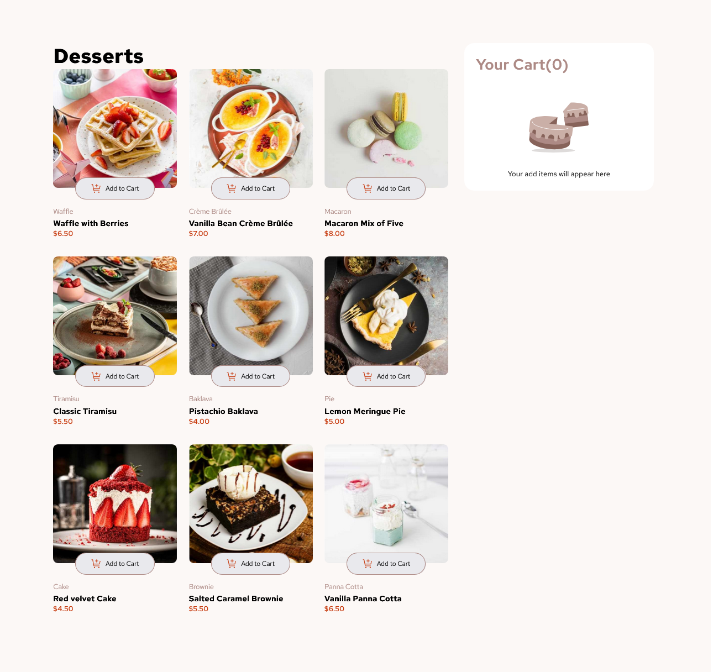
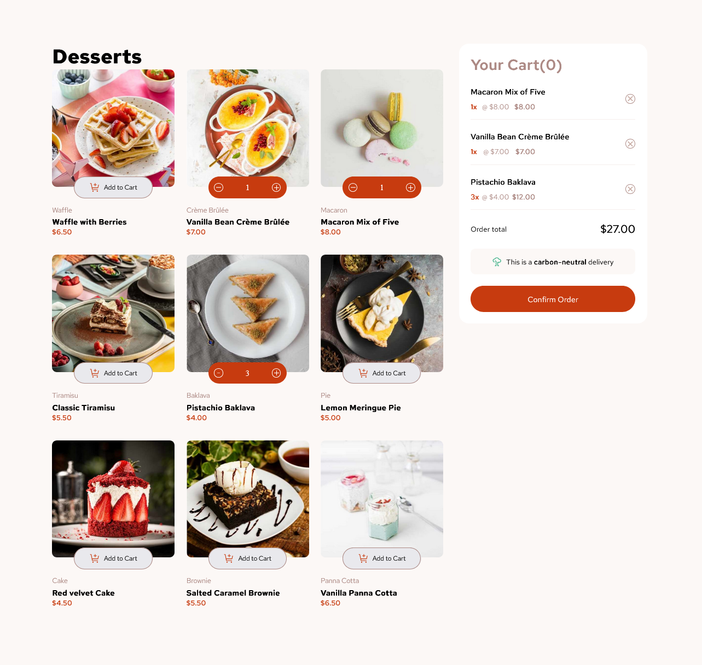
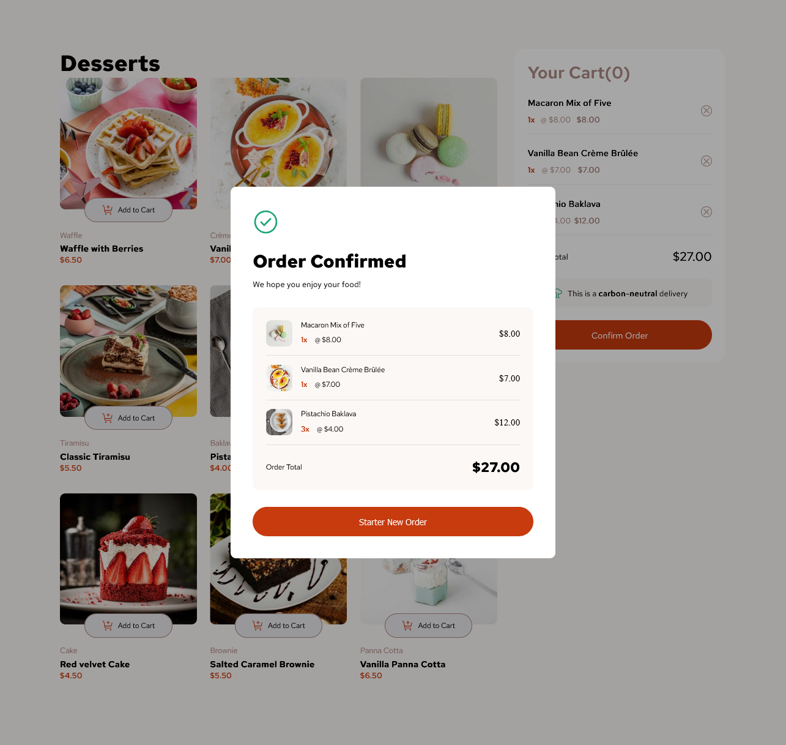

# Frontend Mentor - Product list with cart solution

Está é uma solução do [Product list with cart challenge on Frontend Mentor](https://www.frontendmentor.io/challenges/product-list-with-cart-5MmqLVAp_d). Frontend Mentor challenges ajudá-lo a melhorar suas habilidades de codificação criando projetos realistas.

## Indíce

-   [Visão geral](#visao-geral)
    -   [O desafio](#O-desafio)
    -   [Screenshot](#screenshot)
    -   [Links](#links)
-   [Meu progresso](#meu-progresso)
    -   [construido com](#Construido-com)
    -   [O que eu aprendi](#O-que-eu-aprendi)
    -   [Continuar desenvolvendo](#Continuar-desenvolvendo)
-   [Autor](#Autor)

## Visão-geral

Esse é um projeto de um cardápio aonde podemos adicionar itens no carrinho e confirmar o pedido

### O desafio

Os usuários devem ser capazes de:

-   Adicione itens ao carrinho e remova-os
-   Aumentar/diminuir o número de itens no carrinho
-   Veja um modal de confirmação de pedido quando clicar em "Confirmer Order"
-   Redefina suas seleções quando clicarem em "Start New Order"
-   Veja o layout ideal para a interface dependendo do tamanho da tela do dispositivo
-   Veja os estados de foco e foco de todos os elementos interativos na página

### Screenshot

### Links

-   Solution URL: [Add solution URL here](https://your-solution-url.com)
-   Live Site URL: [Add live site URL here](https://your-live-site-url.com)

## My process

Esse mini projeto, é de dificuldade junior (dificuldade que esta no Frontend Mentor), eu fiz apartir do que estava no figma, primeiramente comecei a analizar o projeto e o que eu iria fazer, analizei e percebi que nesse projeto não trocava de posição a hierarquia de cima para baixo o layout, a não ser a seção de escolha de produtos e o carrinho que no desktop fica um do lado do outro e no mobile / tablet fica em baixo, observei que faria com display flex esse layout, observei que as imagens trocavam de tamanho e verifiquei nos arquivos que tinha uma pra cada tamanho de tela, já entendi que teria que fazer com background-img, assim que montei o HTML e o CSS parti como eu faria as animações, essa parte foi a mais complexa para mim pois é o primeiro projeto então essas teorias e conceitos de funcionalidades de como fazer o programa funcionar nesse caso entender que clicar em um botão e adicionar ao carrrinho, multiplicar o numero de vezes clicado pelo valor e mostra um resultado e os resultados pegar todos os resultados totais e colocar em um valor total foi dificil por que no meio de tudo isso minha cabeça tambem processou como fazer o mais otimizado possivel, as estilização e como iria montar a hierarquias, a primeiro momento tive confusão para consolidar a ideia de funcionamento do projeto, mas usei as ferramentas, peguei um tablet e tirei uma foto e organizei todo o conteudo, apartir disso comecei a desenvolver melhor o projeto, tive dificuldade de como fazer os calculos, lembro que perdi uma tarde inteira resolvendo de como clicar no botão - iria diminuir e no + como aumentar sem que os demais aumentasem ou desse interferencia num calculo a outro o restante do projeto foi facil de fazer na parte do JS e no CSS foi bastante digitação creio que mais a frente precisarei aprender taiwildcss

### Built with

-   Semantic HTML5 markup
-   CSS custom properties
-   Flexbox
-   CSS Grid
-   JS

### O que eu aprendi

Aprendi mais sobre como fazer códigos no JS
Estilização dinamica pelo JS
Otimização de carremento de página web

### Continuar desenvolvendo

TaiwildCSS APIs do js e backend

## Autor

-   Frontend Mentor - [@FredericoGarciasAlves](https://www.frontendmentor.io/profile/yourusername)
-   Twitter - [@FredericoGA70](https://x.com/FredericoGA70)
-   Instagram - [@fred_alves23](https://www.instagram.com/fred_alves23/)
-   Trheads - [@fred_alves23](https://www.threads.net/@fred_alves23)
